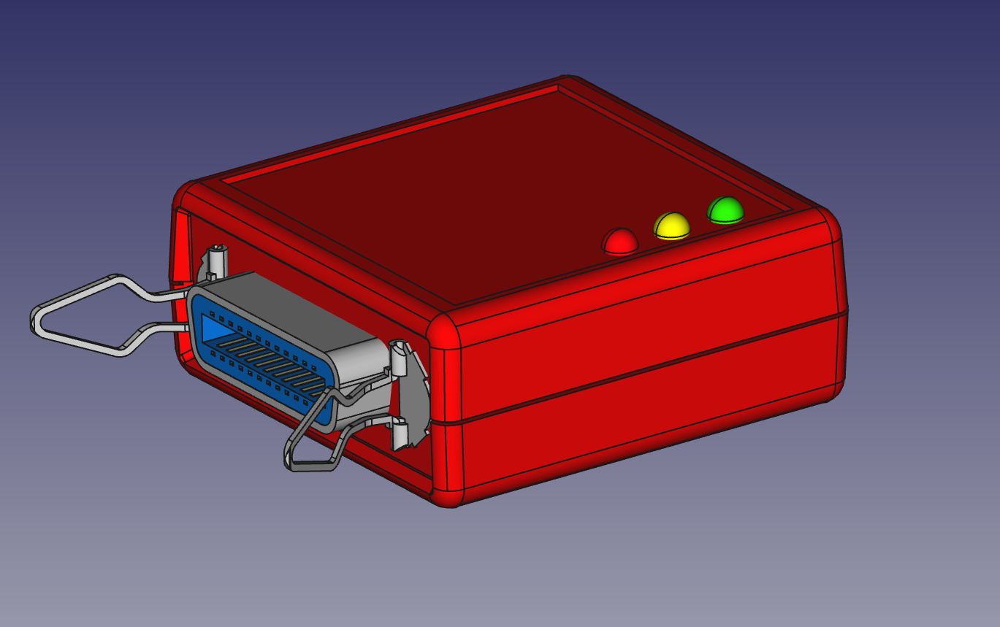

# GPIB (IEEE-488) to usb adapter




We live in wonderful times... Now is possible for us to get pretty good but old and used measurement equipment on e-bay, just for a few bucks. Equipment that otherwise would be out of  the hobbist leage, like 6.5 digit multimeters, oscilloscopes, signal generators... just to name a few.

These old equipment often come with a GPIB interface, which allows to control them from a computer with the corresponding GPIB connection. Regretably, computers do not come with GPIB interfaces, and the adapters available are not cheap.

Here comes this little device to rescue. It is a gpib-to-usb adapter which after connected to the computer via the almighty usb port, it presents itself as a serial port and allows to send GPIB commands to connected GPIB devices.

For now is yet a work in progress.

# Getting Started

The device presents itself as a serial port. The commands are the same as the similar device sold by [Prologix LLC](http://prologix.biz/gpib-usb-controller.html), but compatibility is not guaranteed.

| Command	 | Description |
|----------|-------------|
|++addr 0-31|	Tell controller which device to address|
|++addr	| Query currently configured device address
|++clr	| This command sends the Selected Device Clear (SDC) message to the currently specified GPIB address. Please consult the programming manual for details on how a particular instrument responds to this message.
|++eoi 0/1|	Enable (1) or disable (0) EOI with last byte. Default is 0. This command enables or disables the assertion of the EOI signal with the last character of any command sent over GPIB port. Some instruments require EOI signal to be asserted in order to properly detect the end of a command.
|++eoi	|Query current EOI setting
|++eos 0/1/2/3	|EOS terminator — 0:CR+LF, 1:CR, 2:LF, 3:None. Default is 0. This command specifies GPIB termination characters. When data from host is received over USB, all non-escaped LF, CR and ESC characters are removed and GPIB terminators, as specified by this command, are appended before sending the data to instruments. This command does not affect data from instruments received over GPIB port.|
|++eos	|Query current EOS setting
|++ifc	|Issue interface clear. This command asserts GPIB IFC signal for 150 microseconds making the gpib2usb controller the Controller-In-Charge on the GPIB bus.
|++loc	|Return device to local mode
|++read  [eoi/char]| This command can be used to read data from an instrument until: EOI is detected or timeout expires, or A specified character is read or timeout expires, or Timeout expires. Timeout is set using the read_tmo_ms command and applies to inter-character delay, i.e., the delay since the last character was read. Timeout is not be confused with the total time for which data is read. |
|++read_tmo_ms [1-3000]| This command specifies the timeout value, in milliseconds, to be used in the read command and spoll command. Timeout may be set to any value between 1 and 3000 milliseconds.|
|++spoll	|Read status byte by serial polling the device
|++srq	|Query status of SRQ line. 0: Not asserted, 1:Asserted
|++trg	|Issue device trigger
|++ver	|Query GPIB-USB controller version
|++help	|Print help about commands

To send binary data to instruments following characters must be escaped by preceding them with an ESC character:
CR (ASCII 13), LF (ASCII 10), ESC (ASCII 27), ‘+’ (ASCII 43)

# Contributing


# Know issues

## Disable modem manager in linux.

In order to detect new devices, modem manager issues two AT commands to each new ACM device detected. This blocks the serial port and causes it to be unavailable the first seconds. This is somewhat annoying. Fortunately it is possible to disable this behaviour. You need to create a new file:

```
/etc/udev/rules.d/77-mm-usb-device-blacklist.rules
```
and put following content in it:

```
with content:
# gpib2usb converter
ATTRS{idVendor}=="1209", ATTRS{idProduct}=="0001", ENV{ID_MM_DEVICE_IGNORE}="1"
```
